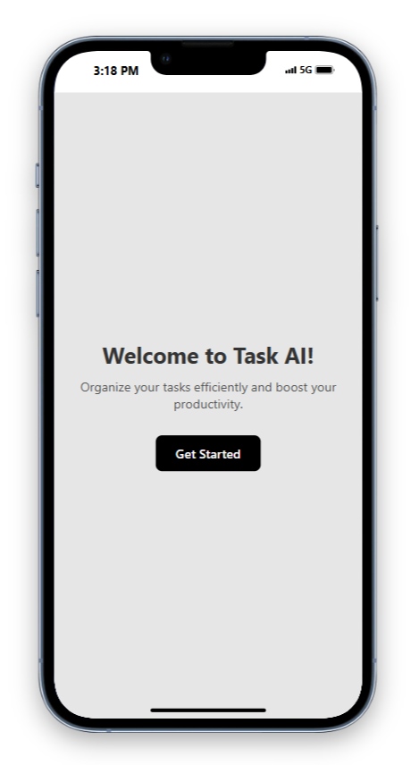
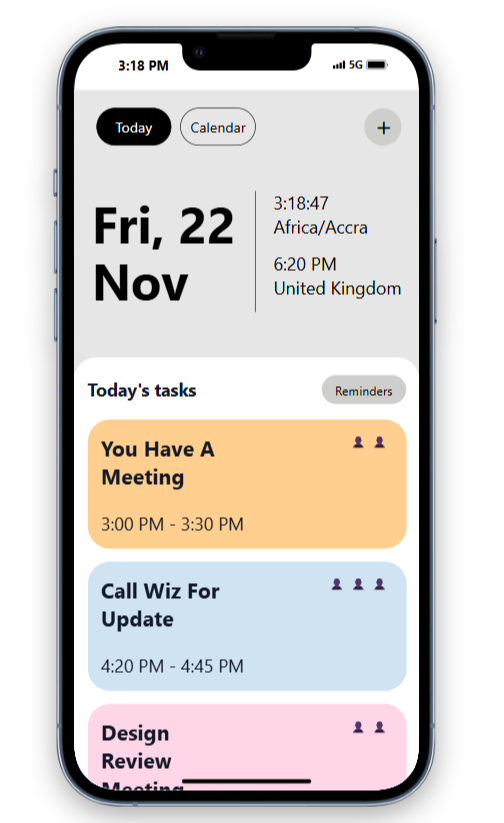
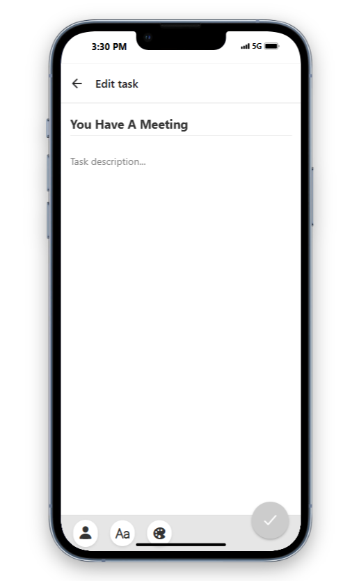
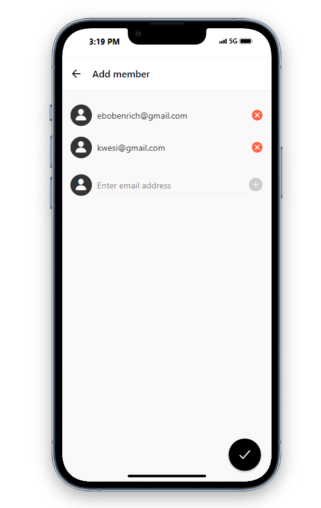

# ✅ Task AI

Welcome to **Task AI**! This application simplifies project and task management, enabling users to create, update, and track tasks effortlessly. Collaborate with team members by inviting them to contribute, ensuring smooth and efficient teamwork.

---






> *Streamline your productivity with TaskMaster Pro.*

---

## 🚀 Features

### 1. **Task Management**
- Add new tasks with detailed descriptions, deadlines, and priorities.
- Edit task details as project requirements evolve.
- Update task statuses (e.g., In Progress, Completed).
- Delete completed or unnecessary tasks.

### 2. **Team Collaboration**
- Invite team members to contribute to specific tasks.
- Assign roles and responsibilities to collaborators.
- Real-time updates to keep everyone on the same page.

### 3. **Task Organization**
- Categorize tasks by projects or tags.
- View tasks by status, priority, or deadline.
- Filter and search tasks for quick access.

### 4. **Notifications**
- Receive notifications for task updates or deadline reminders.
- Alert team members of new assignments or changes.

### 5. **Dashboard Insights**
- Visualize task progress with charts and stats.
- Monitor team contributions and project milestones.

### 6. **Data Security**
- Secure user authentication with JWT.
- Role-based access control to ensure data integrity.

---

## 🛠️ Tech Stack

- **Frontend**: React.js
- **Backend**: Node.js with Express
- **Database**: MongoDB
- **Authentication**: JSON Web Tokens (JWT) and OAuth 2.0
- **Realtime Updates**: Socket.IO
- **Cloud Storage**: Cloudinary for file attachments
- **Push Notifications**: Firebase Cloud Messaging (FCM)

---

## 🔧 Installation and Setup

### Prerequisites:
- [Node.js](https://nodejs.org) installed on your machine.
- [MongoDB](https://www.mongodb.com) database set up and running.
- Environment variable configuration file (`.env`).

### Steps:

1. **Clone the repository**:
   ```bash
   git clone https://github.com/your-username/taskmaster-pro.git

2. Install dependencies

   ```bash
   npm install
   ```

3. Start the app

   ```bash
    npx expo start
   ```


